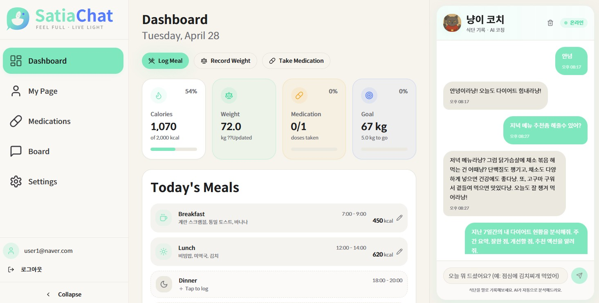
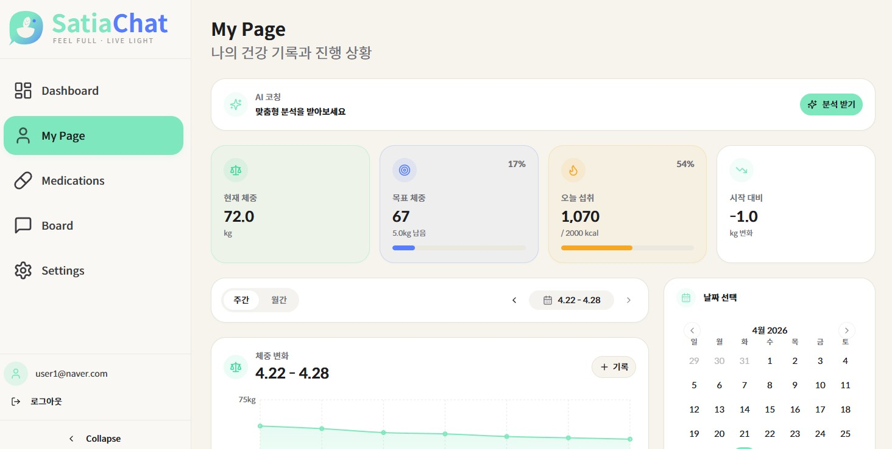
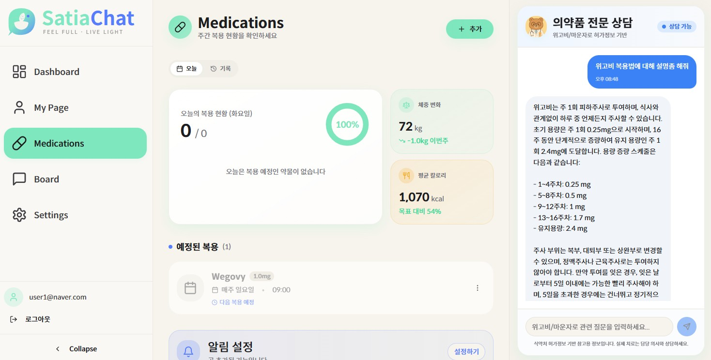
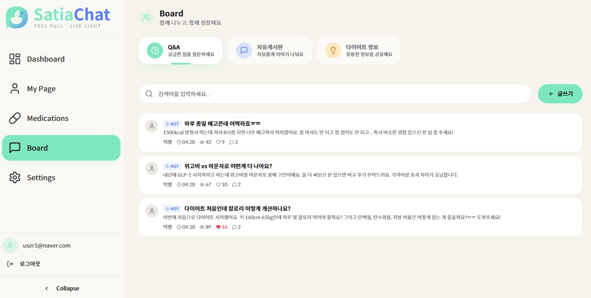

# SatiaChat

AI 페르소나 다이어트 코치 + GLP-1 약물 RAG 상담 서비스



> 위고비·마운자로 같은 GLP-1 다이어트 약 사용자가 부작용이나 복약 시점을 즉시 확인하기 어렵다는 점에서 출발했습니다. 식약처 공식 허가사항을 RAG로 검색해 답변하는 약물 챗봇과, 사용자의 식단·체중·복약 기록을 컨텍스트로 사용하는 AI 다이어트 코치(캐릭터 페르소나 3종)를 함께 제공합니다.

## 주요 기능

| | |
|---|---|
| AI 페르소나 코치 | 3종 캐릭터 — 냥이(쿨/팩트), 댕댕이(따뜻/응원), 꿀꿀이(엄격/직설). 페르소나별 어미·이모지·톤이 system prompt에 일관 적용됩니다. |
| 자연어 식단 자동 기록 | "치킨 먹었어" 한 마디로 OpenAI Function Calling이 음식·칼로리·매크로를 추출해 DB에 저장합니다. 6가지 의도(log/query/stats/modify/analyze/chat)를 사전 분류해 비용·지연을 최적화합니다. |
| GLP-1 약물 RAG 상담 | 식약처 공식 허가사항(위고비·마운자로) 6개 문서를 LlamaIndex로 인덱싱. bge-m3 다국어 임베딩으로 한국어 질의에 대해 top-4 청크 검색 후 GPT-4o-mini가 출처와 함께 답변합니다. |
| 대시보드 | 오늘 칼로리, 체중 변화, 복약 여부를 일·주·월 단위로 집계해 보여줍니다. 위고비·마운자로처럼 주 1회 복용하는 약은 지정한 요일에만 알림이 표시됩니다. |
| AI 주간 인사이트 | 사용자가 "분석 받기"를 누르면 코치가 최근 7일치 식단·체중·복약 데이터를 종합 분석해 맞춤 조언 리포트를 생성합니다. |
| 커뮤니티 게시판 | QnA·자유·정보 3개 탭의 게시판이며, 좋아요/싫어요와 댓글 기능을 제공합니다. |

## 시스템 아키텍처

```
┌────────────────────────────┐         ┌──────────────────────────────┐
│   React (Vite, :8080)       │         │   Supabase                    │
│   shadcn/ui · Tailwind      │ ──CRUD─▶│   - Auth (JWT)                │
│   TanStack Query            │   RLS   │   - PostgreSQL                │
└──────────────┬──────────────┘         │   - 한식 영양 DB              │
               │                         └──────────────────────────────┘
               │ Bearer JWT
               ▼
┌────────────────────────────┐         ┌──────────────────────────────┐
│   FastAPI 메인 서버 (:8000)  │ ──HTTP─▶│   medication-rag (:8001)     │
│   - /chat (식단 챗봇)        │         │   LlamaIndex + bge-m3         │
│   - /summary (오늘/주/월)    │         │   위고비/마운자로 허가사항    │
│   - /medication (proxy)     │         │                              │
│   OpenAI GPT-4o-mini        │         │                              │
└──────────────┬──────────────┘         └──────────────────────────────┘
               │
               ▼
        OpenAI Function Calling
        (식단 기록 / 조회 / 수정 / 삭제)
```

## 기술 스택

- **Backend**: Python · FastAPI · LlamaIndex · Supabase
- **Frontend**: React · TypeScript
- **외부 API**: OpenAI · 식약처 nedrug

## 사전 요구사항

- Node.js 18+
- Python 3.10+
- [Supabase](https://supabase.com) 계정 (무료 플랜 가능)
- [OpenAI API 키](https://platform.openai.com/api-keys)

## 로컬 실행

### 1. 환경변수 설정

루트에 `.env.local` 생성:

```bash
VITE_SUPABASE_URL=https://your-project.supabase.co
VITE_SUPABASE_ANON_KEY=your-anon-key
VITE_API_URL=http://localhost:8000/api/v1
VITE_RAG_API_URL=http://localhost:8001
```

`server/.env` 생성:

```bash
OPENAI_API_KEY=sk-...
SUPABASE_URL=https://your-project.supabase.co
SUPABASE_ANON_KEY=your-anon-key
SUPABASE_SERVICE_ROLE_KEY=your-service-role-key
SUPABASE_JWT_SECRET=your-jwt-secret
PORT=8000
CORS_ORIGINS=http://localhost:8080
```

`medication-rag/.env` 생성:

```bash
OPENAI_API_KEY=sk-...
```

### 2. DB 마이그레이션

Supabase SQL Editor에서 `supabase/schema.sql` 실행 후, `supabase/migrations/` 안 SQL 파일들을 순서대로 실행합니다.

### 3. 의존성 설치

```bash
# 프론트엔드
npm install

# 메인 백엔드
cd server
python -m venv venv
source venv/Scripts/activate   # Windows: venv\Scripts\activate
pip install -r requirements.txt

# 약물 RAG 서비스 (별도 venv)
cd ../medication-rag
python -m venv venv
source venv/Scripts/activate
pip install -r requirements.txt
```

### 4. 실행 (3개 프로세스)

각각 다른 터미널에서:

```bash
# 1. 프론트엔드 (:8080)
npm run dev

# 2. 메인 백엔드 (:8000)
cd server && source venv/Scripts/activate
python -m uvicorn main:app --host 0.0.0.0 --port 8000 --reload

# 3. 약물 RAG 서비스 (:8001)
cd medication-rag && source venv/Scripts/activate
python -m uvicorn api:app --host 0.0.0.0 --port 8001
```

브라우저에서 http://localhost:8080 접속.

## 디렉토리 구조

```
.
├── src/                        # React 프론트엔드
│   ├── pages/                  # 페이지 (Dashboard, MyPage, Medications, Board, Settings 등)
│   ├── components/             # 컴포넌트
│   └── hooks/                  # TanStack Query 훅
│
├── server/                     # FastAPI 메인 백엔드
│   ├── api/v1/                 # 라우터 (chat / medication / summary)
│   ├── ai/
│   │   ├── prompts/            # 의도 분류 + 페르소나 + 의도별 프롬프트
│   │   └── tools/              # OpenAI Function Calling 도구
│   ├── services/               # 챗봇·식단·컨텍스트 서비스
│   └── core/                   # config, security, exceptions, logging
│
├── medication-rag/             # 약물 RAG 별도 서비스
│   ├── docs/                   # 위고비·마운자로 허가사항 텍스트 (식약처)
│   ├── storage/                # 벡터 인덱스 (빌드된 상태)
│   ├── fetch_documents.py      # 식약처 nedrug에서 문서 다운로드
│   ├── build_index.py          # LlamaIndex 벡터 인덱스 빌드
│   ├── rag_core.py             # RAG 코어 (bge-m3 + GPT-4o-mini)
│   └── api.py                  # FastAPI 서버
│
├── supabase/
│   ├── schema.sql              # 테이블 + RLS 정책
│   └── migrations/             # 추가 마이그레이션
│
└── scripts/                    # 한식 음식 영양 데이터 적재 스크립트
```

## 스크린샷

### My Page — 체중 추이 + AI 코칭



### 약물 RAG 챗봇 — 위고비 복용법 응답



### 커뮤니티 게시판


